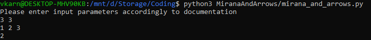

# Mirana and arrows
This is solution for the challenge from technical part evaluation for robotics course.
You can find original description of the task in the file _task_desciprion.pdf_ in the repository.

# Files
- _mirana_and_arrows.py_ - file with the solution
- _tests.py_ - tests suit for the solution
- _task_description.pdf_ - original task description in PDF format
- _README.md_ - documentation

# How to run?
To execute code you need to run mirana_and_arrows.py and enter input values line by line:

Command to run:
_python3 mirana_and_arrows.py_

No any additional requirements except Python.
See how it should look like on the screenshot below:

**Input parameters**:
The first line contains two integers N and K, where N is the number of arrows and K is the maximum
cumulative distance the arrows can fly. The next line contains N integers Ai representing the distances the
arrows can fly.

**Output**:
A single integer - the answer to the problem, the maximum number of arrows Mirana can release to avoid
peril.

Tested using python3.7 and python3.10.

# Tests
You can find tests suit in tests.py file. Just execute this file using python 
and it will show if anything is wrong.  You can try to break the code.

Command to run:
_python3 tests.py_

# How to read the code?
In the end of the _mirana_and_arrows.py_ file you may find execution entry point.
This if statement is responsible for input parsing 
(using utility _parse_numbers_ from the top of the file) and delegating further execution to
_solve_mirana_challenge_ function which contains all the logic.
You can also find helpful docstring for statements which can be unclear.
